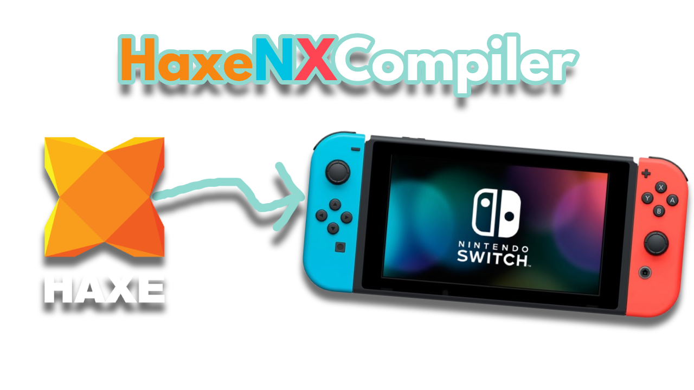

<h1 align="center">HaxeNXCompiler</h1>
<h2 align="center">A tool for creating homebrew for the Nintendo Switch using Haxe!</h2>

---------

A tool designed so that, together with a [custom hxcpp fork](https://github.com/Slushi-Github/hxcpp-nx) and the DevKita64 tools, you can compile a [Haxe](https://haxe.org) program for the Nintendo Switch and even for other platforms!

This is inspired by an attempt by the [RetroNX Team](https://github.com/retronx-team) to use Haxe on the Nintendo Switch. I used part of the [original project](https://github.com/retronx-team/switch-haxe) for this so credit goes to them for achieving this in the first place!

**This project is being tested with Haxe 4.3.6 and a Nintendo Switch V2 with firmware 20.4.0 and Atmosphère 1.9.4.**

---------

**Officially** there are supported libraries to be used in conjunction with HaxeNXCompiler:

- [hx_libnx](https://github.com/Slushi-Github/hx_libnx): Haxe/hxcpp ``@:native`` bindings for libnx, the Nintendo Switch's homebrew library.

- SDL2 (And SDL2_Image, SDL2_Mixer): Haxe/hxcpp ``@:native`` bindings for SDL 2.28 libraries (PRIVATE LIBRARY).

- OpenGL 4.3 ES: Haxe/hxcpp ``@:native`` bindings for the OpenGL 4.3 ES, a 3D graphics library (PRIVATE LIBRARY).

- libVorbis: Haxe/hxcpp ``@:native`` bindings for libvorbis, a decoder for the OGG Vorbis audio format (PRIVATE LIBRARY).

- OpenAL Soft: Haxe/hxcpp ``@:native`` bindings for OpenAL Soft, a 3D audio library (PRIVATE LIBRARY AND NOT FINISHED).

- FontStash: Haxe/hxcpp ``@:native`` bindings for FontStash, a font rendering library compatible with OpenGL and OpenGL ES (PRIVATE LIBRARY AND NOT FINISHED).

The term *"**officially**"* does not mean that only these libraries will work with this tool; they are simply the libraries that I have created specifically for this project and for the Nintendo Switch. However, you can try any libraries you want that are in [Haxelib](https://lib.haxe.org)! (with certain limitations; remember that this is a separate target from the normal ones and is experimental; libraries that depend on C++ libraries will generally not work without changes. And no, don't try to use HaxeFlixel on this target... for now?).

## How is this possible?

Well, let's start at the beginning.

Haxe on Nintendo Switch can be used officially through the Nintendo Developer program, giving access to modified versions of certain Haxe libraries, but as far as I know, these are old libraries alongside an old version of Haxe and an old version of hxcpp.

When I started wanting a Wii U, I found out about a very old case of bringing Haxe, or rather [OpenFL](https://www.openfl.org), to consoles, called ["OpenFL for Home Game Consoles."](https://www.fortressofdoors.com/openfl-for-home-game-consoles). Among the “targets” was the Wii U. I don't know what came of that, but I don't think it was anything important or interesting. I currently understand that the only console where Haxe is supported is the Nintendo Switch.

To which I had found a project that modified hxcpp to make it functional with the Nintendo Switch, but it was a very basic attempt at just a "hello world.", that project was [switch-haxe](https://github.com/retronx-team/switch-haxe). 

Although with the Wii U I had to choose to use [Reflaxe/C++](https://github.com/SomeRanDev/reflaxe.CPP) to use Haxe there, which resulted in [HxCompileU](https://github.com/Slushi-Github/hxCompileU), when I got a Nintendo Switch, I already knew that I could use Haxe with hxcpp on this console. And that's what this project is about:

Providing the ability to use Haxe on a Nintendo Switch freely and with what the homebrew of this console allows!

## What does this tool do?

This tool helps you compile a Haxe project more easily and obtain executable files for a Nintendo Switch.

An XML project file is used, based on the XML file of Haxe projects made with [Lime](https://lime.openfl.org)/[OpenFL](https://www.openfl.org).

Want to start a new project? Then go to the guide on [how to get started](docs/guides/GetStarted.md).

Want create a library for this tool? Then go to the guide on [how to create a library](docs/guides/LibrariesGuide.md).

Want to use assets with this tool? Then go to the guide on [how to use assets](docs/guides/AssetsGuide.md).

## License

This project is released under the [MIT License](LICENSE.md).