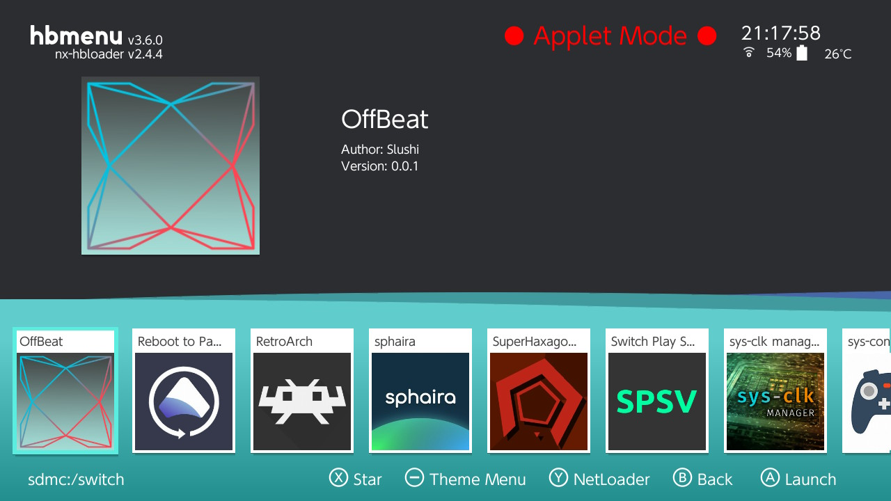

## RomFS

The ``romfs`` folder is a folder that contains files that will be added to the ``.nro`` file.

1. If you want to use it in your main project:

    Create a folder called "assets" Inside it, I recommend that you create another folder where you can then place your files.

2. If you want to use it in a library:

    Create a folder called "assets" Inside this folder, create a folder called "ROMFS" Inside this folder, we recommend that you create another folder where you will store your files.

And then, automatically, HaxeNXCompiler would copy all the contents of this folder to where it matters and include it in the final ``.nro`` if the compilation is successful.

Now you need to initialize RomFS in your project. Here is an example:

```haxe
// import the RomFS class from hx_libnx
import switchLib.runtime.devices.Romfs_dev;

import switchLib.Result;
import switchLib.Types.ResultType;

// Initialize RomFS
var rc:ResultType = Romfs_dev.romfsInit();
    if (Result.R_FAILED(rc)) {
        // Error handling here
    }
```

```haxe
// Do something with RomFS:

import sys.io.File;

var fileContent:String = File.getContent("romfs:/assets/file.txt");
```

```haxe
// import the RomFS class from hx_libnx
import switchLib.runtime.devices.Romfs_dev;

import switchLib.Result;
import switchLib.Types.ResultType;

// You NEED to close RomFS at the end of your program

var rc:ResultType = Romfs_dev.romfsExit();
if (Result.R_FAILED(rc)) {
    // Error handling here
}
```

And that's it!

# Icon project

By default, HaxeNXCompiler will include a default icon instead of letting libnx do it:



But you can add your own icon!

If the icon is in your main project or library:

Inside the "assets" folder, place your icon in JPG format and name it “icon” or the name of your project, I recommend only "icon".

The order of preference is as follows:

1. If there is an icon in the main project, it will use that one directly, regardless of whether there are others in any other library.

2. If there is no icon in the main project, it will use the first one it finds in the first library it encounters.

3. If no icon is found, the default icon from HaxeNXCompiler will be used.